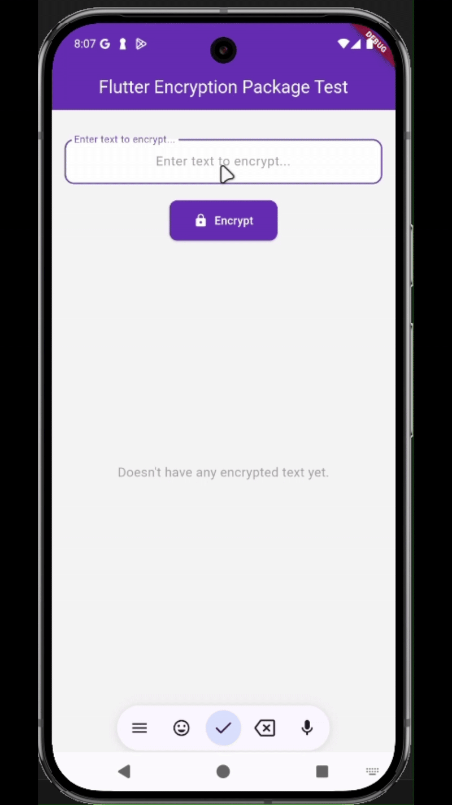

# Flutter Encryption Package Test

I created this application to gain a better understanding of encryption in Flutter.

This Flutter application demonstrates simple text encryption and decryption using the [`encrypt`](https://pub.dev/packages/encrypt) package. Users can enter any text, encrypt it with a randomly generated key and IV, and view both the encrypted and decrypted results.

## Features

- **Encrypt Text:** Enter any text and encrypt it securely using AES (CBC mode) with a random key and IV.
- **View Encrypted Data:** See the encrypted output, key, and IV (all in Base64).
- **Decrypt on Tap:** Tap any encrypted entry to view the original decrypted text in a dialog.
- **User-Friendly UI:** Clean and simple interface for easy testing and demonstration.

## Demo

## How It Works

1. Enter text in the input field.
2. Tap the **Encrypt** button.
3. The app encrypts the text and displays it in a list.
4. Tap any item in the list to see the decrypted (original) text.
